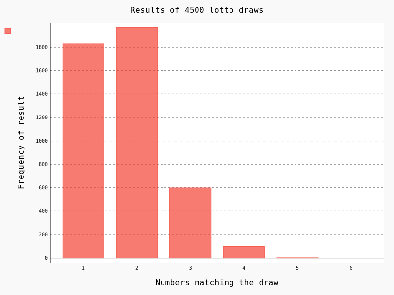

# Lotto simulation script using random numbers

Script which allows user to pick 6 numbers and compare the set against few thousands draws, to evaluate whether the investment matches the value of prizes.



## Assumption

The simulation aims to show the amount of money lost vs. money won in the lottery, assuming a regular participation and fixed set of picked numbers.

_Based on polish currency and lotto rules including the value of prizes._

_3 draws per week * 30 years of lifetime participation_

## Development setup

Script uses [Pygal](http://www.pygal.org/en/stable/index.html) module for chart creation

```pip install pygal```
```pip install cairosvg```
